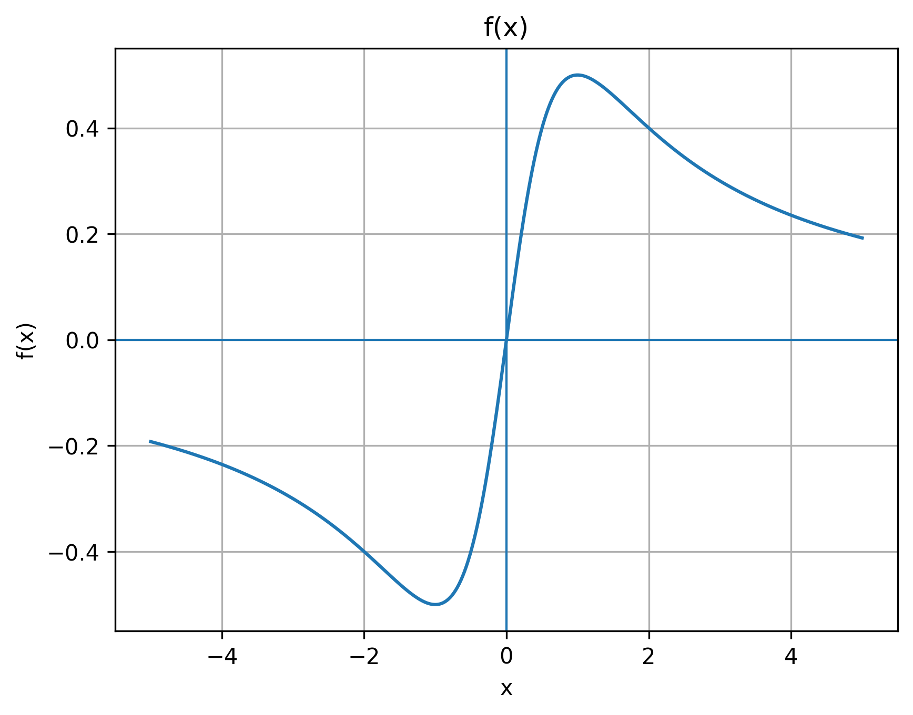

# Guía de prueba (directivas multilínea)

Esta guía mínima prueba que el pipeline genera una imagen desde una directiva en Markdown, y que Pandoc convierte correctamente ecuaciones en LaTeX a Word (editables).

La función que analizaremos es:

\[
f(x) = \frac{x}{x^2 + 1}
\]

A continuación se muestra la gráfica en el intervalo \([-5, 5]\):

<!-- plot
kind=func2d
file=graficas/funcion_prueba.png
expr=x/(x**2+1)
xmin=-5
xmax=5
n=400
title=f(x) = x/(x^2 + 1)
xlabel=x
ylabel=f(x)
-->

