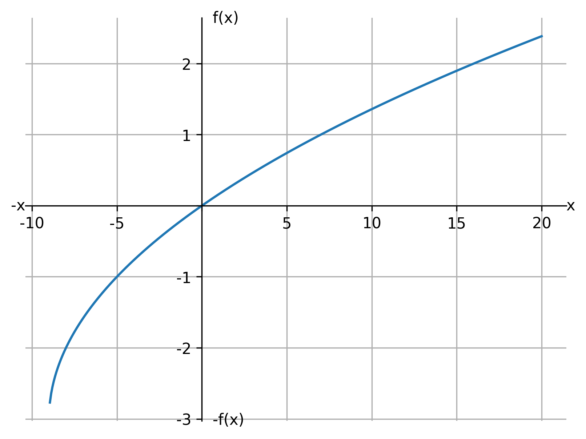

## Aplica tu conocimiento (versión profesor)

Trabaja de manera individual. Al terminar, puedes comparar y evaluar el trabajo de una compañera o compañero más. Si hay diferencias, ¿cuáles? ¿por qué? Argumenten y resuélvanlas.

Si \(f\) es una **función raíz cuadrada** y los valores de la función se obtienen mediante la regla de correspondencia:

\[
y=f(x)=\sqrt{x+9}-3
\]

la variable \(x\) **no puede tomar cualquier valor real**.

### a) ¿Qué valores no puede tomar la variable independiente? ¿"x" puede tomar el 0?
**Respuesta:** Para que exista la raíz cuadrada se requiere \(x+9 \ge 0\), por lo tanto \(x \ge -9\).  
Sí, **\(x=0\)** es válido porque \(0+9=9\) y \(\sqrt{9}\) existe.

### b) ¿Cuál es el dominio de la función?
**Respuesta:**  
\[
\text{Dom}(f)=\{x\in\mathbb{R}\mid x\ge -9\}=[-9,\infty)
\]

### c) Traza el gráfico de la función y describe su comportamiento.
**Respuesta (comportamiento):**
- La gráfica **inicia** en el punto \((-9,-3)\).
- Es **creciente** (a mayor \(x\), mayor \(y\)).
- Su crecimiento se va **haciendo más lento** conforme \(x\) aumenta (la curva se “aplana”).

### Tabla de valores (ya completa)

| x (entrada) | -9 | -8 | -5 | 0 | 7 | 16 |
|---:|---:|---:|---:|---:|---:|---:|
| \(y=f(x)\) | -3 | -2 | -1 | 0 | 1 | 2 |

A continuación se muestra la gráfica de la función:

<!-- plot
kind=func2d
file=graficas/funcion_raiz_ejercicio.png
expr=sqrt(x+9)-3
xmin=-10
xmax=20
n=400
title=f(x) = sqrt(x+9) - 3
xlabel=x
ylabel=y
-->

